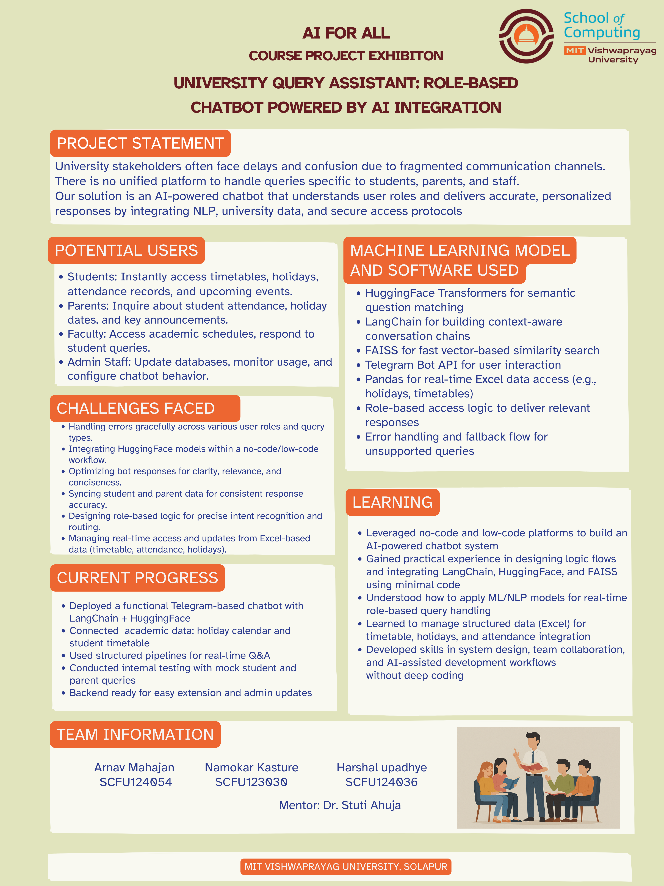

# 🎓 University Query AI Chatbot

## 🚀 Overview
This project is an AI-powered role-based chatbot designed to handle university-related queries efficiently.

It provides personalized responses to students, parents, faculty, and admin users using AI and structured academic data.

---

## 🤖 Features
- 🔐 Role-based authentication (Student / Parent / Faculty / Admin)
- 📱 Telegram Bot integration
- 🧠 AI-powered question answering using LangChain & HuggingFace
- 📅 Timetable and holiday query system
- ⚡ Fast semantic search using FAISS
- 📊 Real-time data handling using Excel

---

## 🛠️ Tech Stack
- Python
- LangChain
- HuggingFace Transformers
- FAISS
- Telegram Bot API
- Pandas

---

## 📂 Project Files
- `mainpro.py` → Main chatbot logic  
- `.env.example` → Environment variables setup  
- `requirements.txt` → Dependencies  
- `poster.png` → Project poster  

---

## 📌 Project Poster


---

## ⚙️ How to Run
```bash
pip install -r requirements.txt
python mainpro.py
